# KeepWatching! Client

This project was bootstrapped with [Create React App](https://github.com/facebook/create-react-app).

## Features

### Authorization
All the routes are protected except the login and register pages. Once a user is successfully logged in, the application becomes available.

#### Login
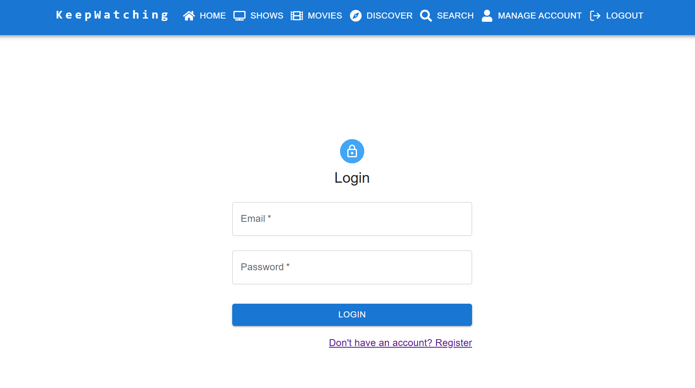

#### Register

###
After logging in or registering, users are redirected to the home page, where their account picture is displayed with cards for each created profile. Users can click on the 'Shows' or 'Movies' chips within a profile card to view those items for that profile. They can also select a watch status count to view that content filtered to that watch status.

### Account Management
Once an account is created or a an existing account is logged in, they can manage the account by uploading an account picture or adding profiles to group/manage the shows & movies being tracked. Profiles can have their names edited; they can also be deleted.

#### Manage Account
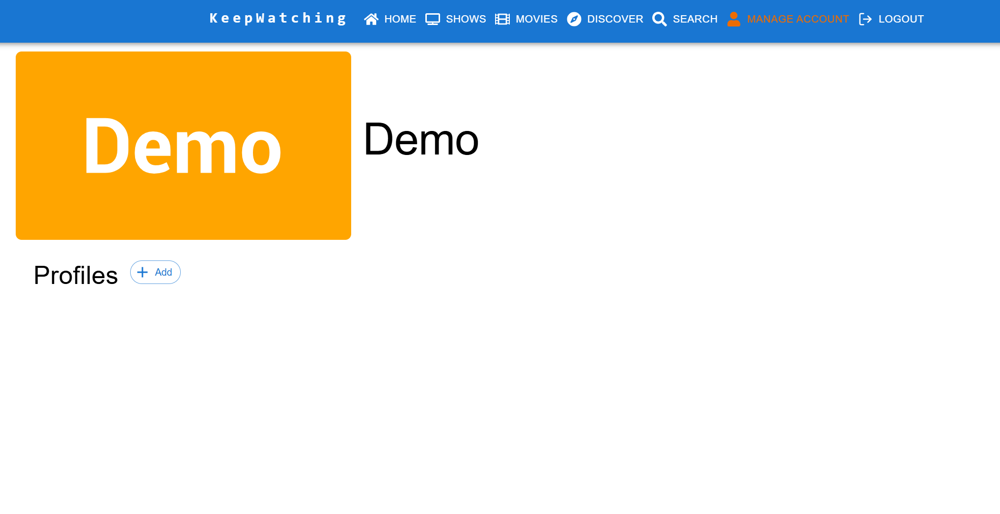
#### Manage Account - Upload Image
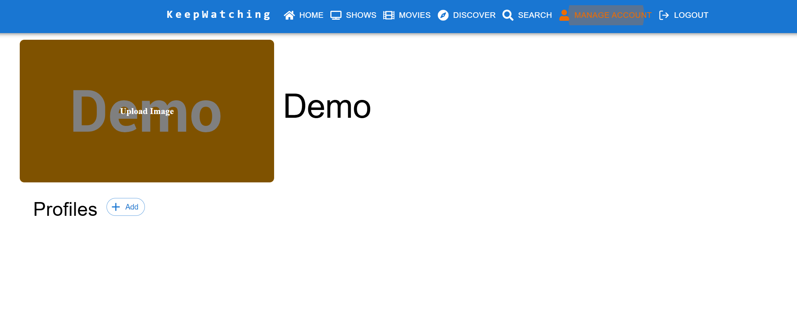
#### Manage Account - Add Profile
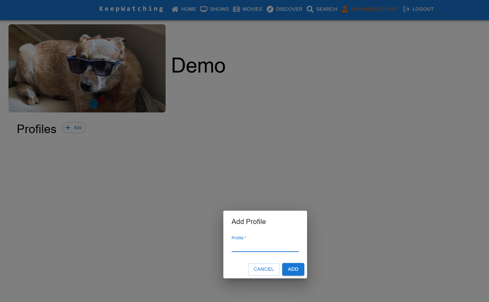
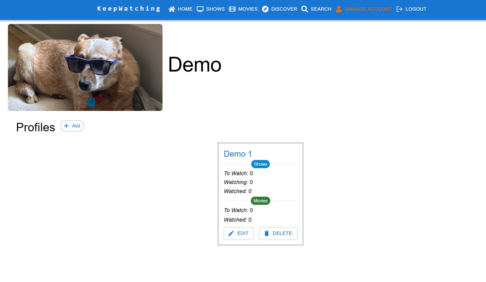
#### Manage Account - Edit Profile
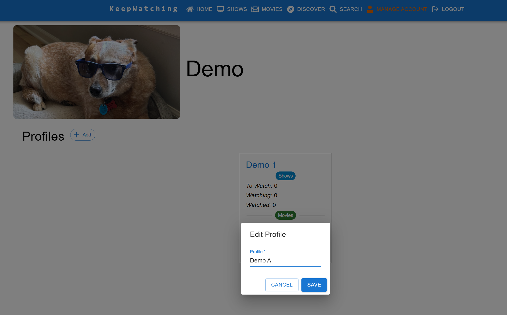
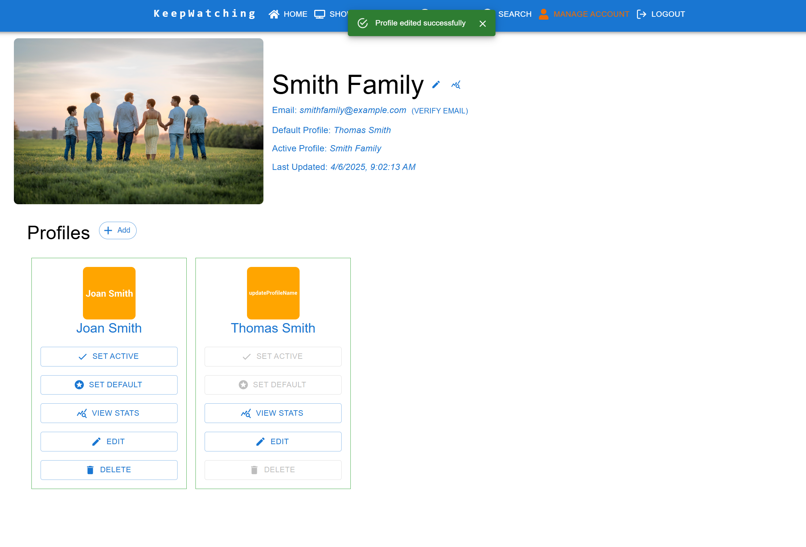
#### Manage Account - Delete Profile
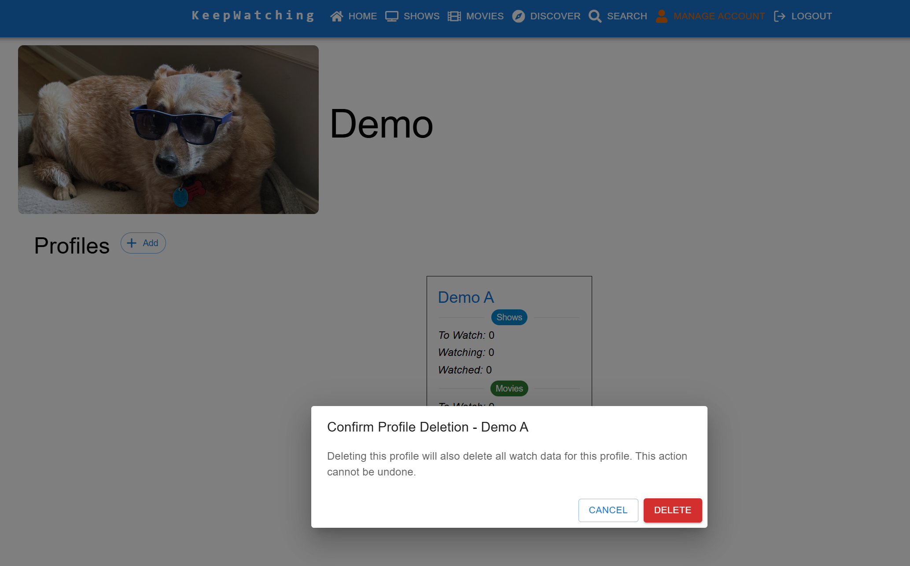
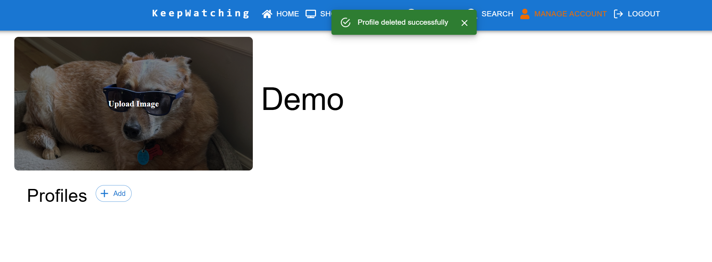

### Search
Users are able to search TV Shows and Movies and favorite a search result for a profile to track that show or movie.

#### Search TV
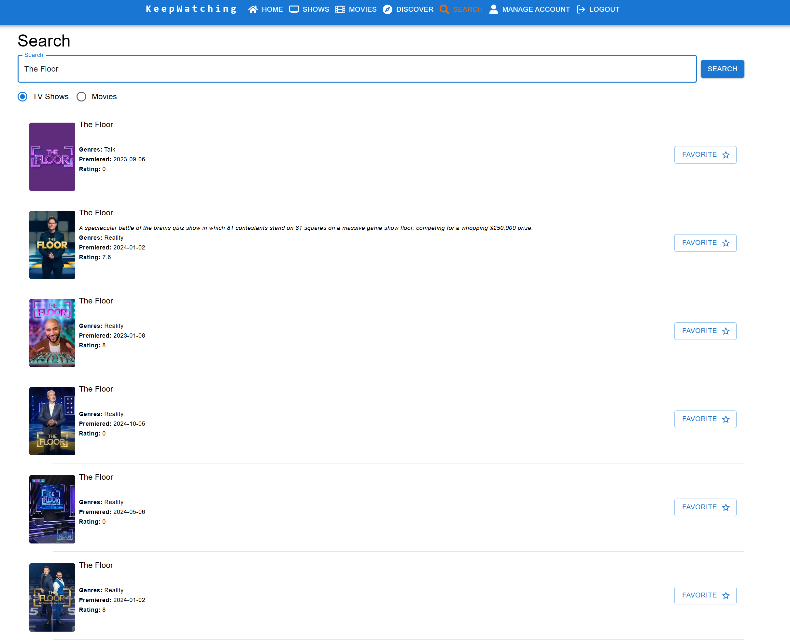

#### Search Movies
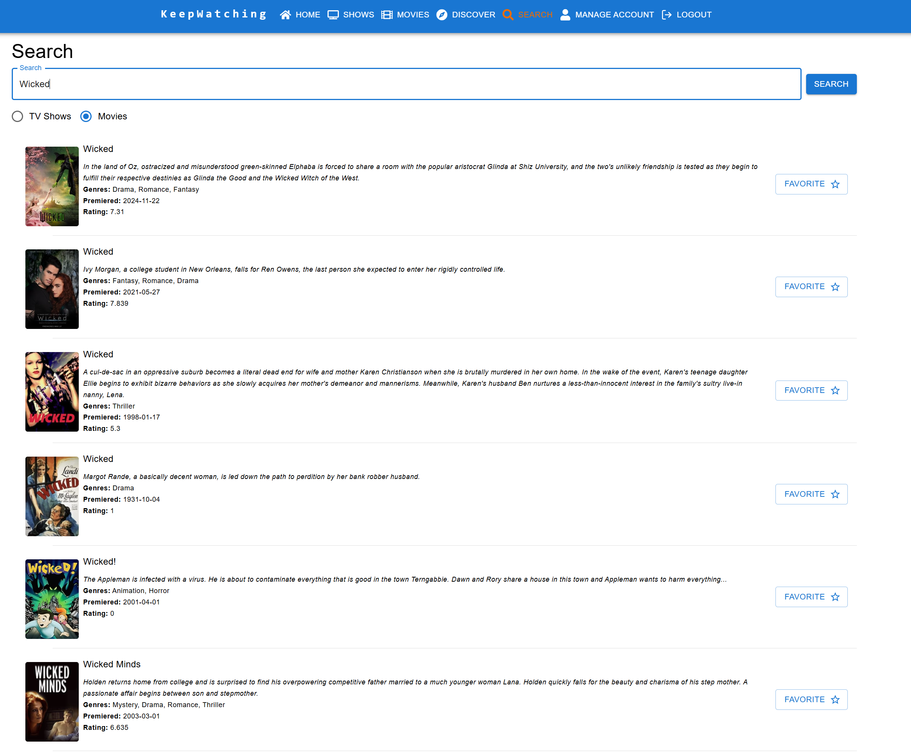

### Discovery
Coming Soon!

### Shows
When first navigating to the Shows page, no profile is selected.
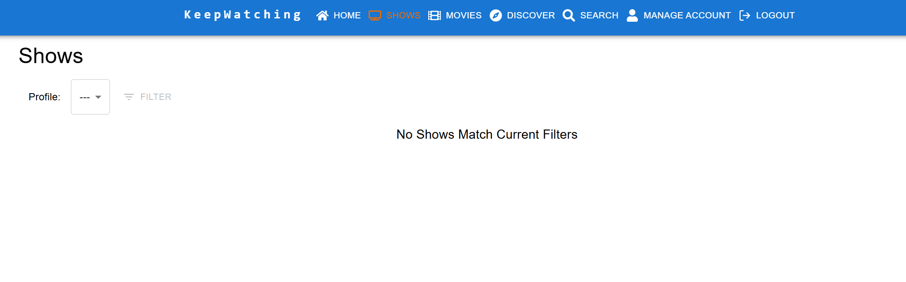
After selecting a profile from the drop-down, the shows for that profile will be displayed.
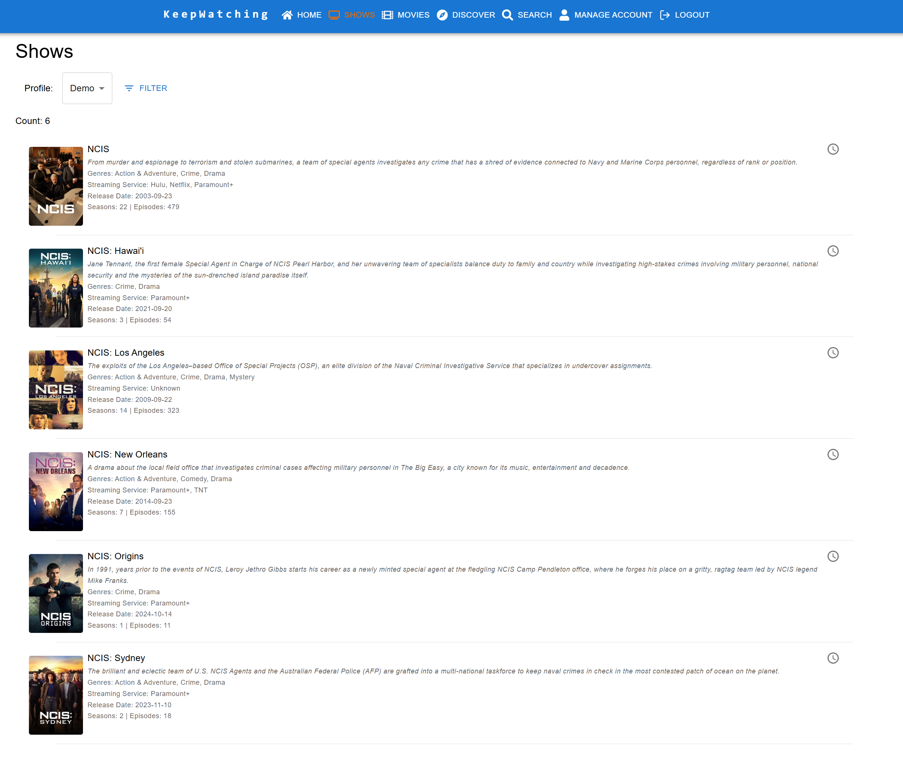
The list of shows can further be filtered by Genre, Streaming Service and Watch Status.
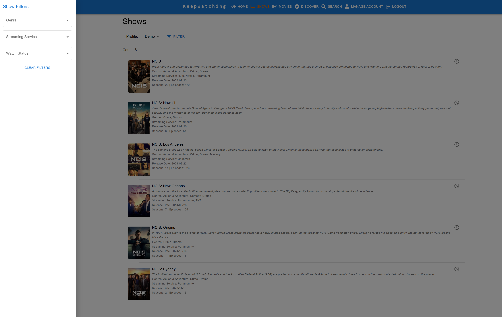
Users can mark a show as watched (if current status is not watched or watching) or not wacthed (if current status is watched). Marking a show as watched will also mark all seasons and episodes for that show as watched and vice versa for not wacthed.

Selecting a show will take the user into the details for that show. This view will show a list of the shows seasons and each season can be expanded to display the episodes for the season. Like shows, the watch status of a season or episode can be set.

### Movies
When first navigating to the Movies page, no profile is selected.

After selecting a profile from the drop-down, the movies for that profile will be displayed.

The list of movies can further be filtered by Genre, Streaming Service and Watch Status.

